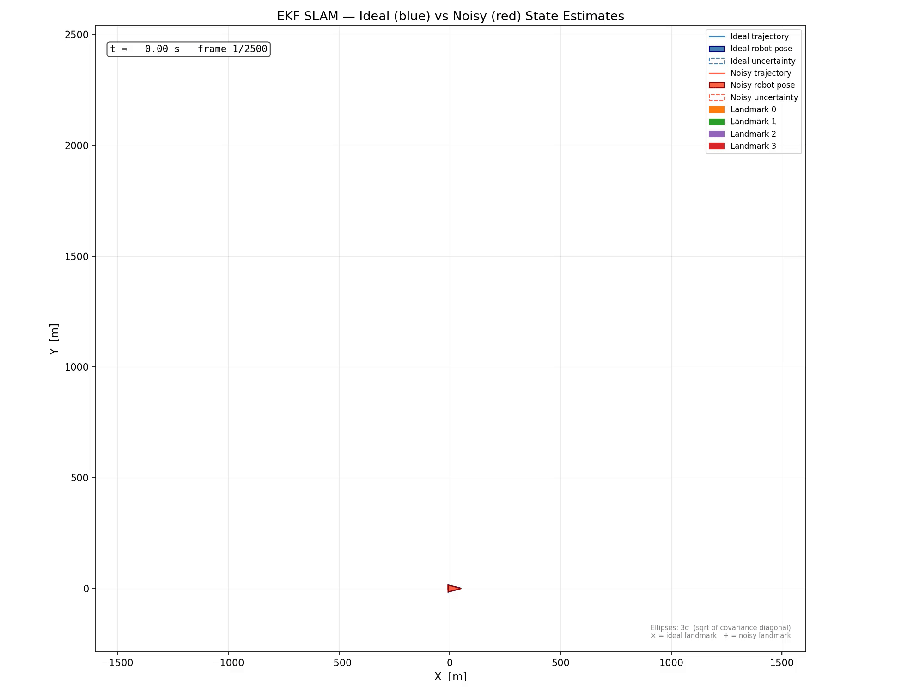

# Extended Kalman Filter SLAM

A C++17 implementation of EKF-based Simultaneous Localization and Mapping (SLAM) for a 2D robot with range-and-bearing landmark observations.

## Demo



The animation shows two EKF SLAM instances running in parallel:
- **Left** — ideal odometry (no control noise), measurement update disabled
- **Right** — noisy odometry with active EKF measurement correction

Each frame displays the robot pose (triangle), its uncertainty ellipse (3σ), the estimated landmark positions (crosses), and their uncertainty ellipses.

## How it works

The state vector is 11-dimensional: robot pose `(x, y, θ)` plus four landmarks `(x, y)` each.

| Step | Description |
|---|---|
| **Predict** | Propagates robot pose via a nonlinear motion model; landmarks stay fixed. Covariance is updated via the motion Jacobian. |
| **Update** | When a landmark enters the sensor range (500 units), a range-bearing measurement is fused using the EKF update equations. |
| **Init** | On first observation, a landmark is initialised in world coordinates from the current pose estimate. |

## Dependencies

| Library | Purpose |
|---|---|
| [Eigen3](https://eigen.tuxfamily.org) | Matrix algebra |
| [GTest](https://github.com/google/googletest) | Unit tests (optional) |
| Python 3 + matplotlib + pandas | Animation script |

On Ubuntu/Debian:
```bash
sudo apt install libeigen3-dev libgtest-dev python3-matplotlib python3-pandas
```

## Build

```bash
cmake -B build
cmake --build build
```

To skip tests:
```bash
cmake -B build -DBUILD_TESTS=OFF
cmake --build build
```

## Run

```bash
./build/ExtKalmanSlam        # produces build/ekf_state_log.txt
python3 animate_ekf.py       # renders the animation
```

## Project structure

```
.
├── ext_kalman_slam.h        # EKF SLAM class (predict, update, init)
├── main.cpp                 # Simulation loop, logging
├── animate_ekf.py           # Matplotlib animation from log file
├── cotrans.cpp / .h         # 2D coordinate transforms
├── angle_tool.h             # Angle normalisation utility
├── position2d.h             # 2D pose struct
├── test_ext_kalman_slam.cpp # GTest unit tests
└── CMakeLists.txt
```
